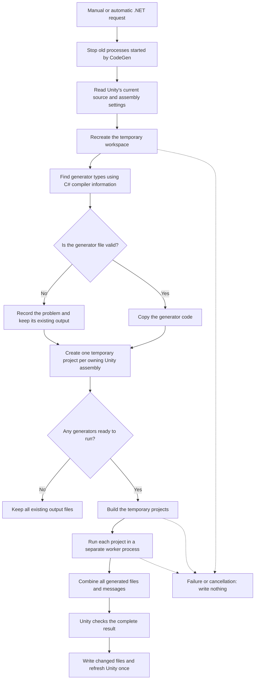

# EncosyTower Editor CodeGen

`EncosyTower.Editor.CodeGen` is closed internal infrastructure that runs Encosy
Tower's file generators inside the Unity Editor. Users do not reference this
assembly; its assembly definition is non-auto-referenced and Unity loads it for
Editor initialization.

It finds types marked with `[CodeGenerator]` that implement
`ICodeGenerator`, runs them in Unity or in a temporary .NET workspace, then
checks and writes the returned files.

Code generation runs only when requested. It is not part of normal C#
compilation.

## Running code generation

Use either menu command:

- `Encosy Tower/CodeGen/Generate in Unity`
- `Encosy Tower/CodeGen/Generate in .NET`

Each command always uses the mode named in the menu.

Automatic generation is configured at
`Preferences/Encosy Tower/CodeGen`. All options are off by default.

`Retain .NET Solutions` applies to every .NET backend run, including the manual
`Generate in .NET` command. It is independent from the automatic-run backend option.

| Automatic generation | Use temporary .NET solution | Result |
|---|---|---|
| Off | Either | Run only from the menu |
| On | Off | Run in Unity after the first load and each successful compilation |
| On | On | Run in .NET after the first load and every compilation, even a failed one |

Only one run can be active. Repeated automatic requests are combined into one.
A manual request replaces an automatic request that is still waiting.

## What happens during a run

Both modes use the same outer process:

1. Choose the requested run mode.
2. Find and run generators.
3. Collect every generated file and message.
4. Check all output paths and contents.
5. Write only files whose contents changed.
6. Refresh Unity once when files changed.

The Unity and .NET modes never write files directly. They return a complete
result to `GeneratedCodeBatchWriter`, which owns all file changes.

If generated files cause Unity to compile again, CodeGen ignores that one
compilation event. This prevents an automatic generation loop.

## Unity mode

Unity mode runs generator code that is already loaded in the Editor.

A generator must:

- have `[CodeGenerator]`;
- implement `ICodeGenerator`;
- be a class or struct that is not abstract;
- not have unfilled generic type parameters;
- have a parameterless constructor;
- come from a source file inside the project `Assets` or `Packages` folder.

Generators run one at a time on Unity's main thread. One failing generator
produces an error message, but other valid generators can still run.

If Unity compilation has failed, the loaded generator code may be from the last
successful compilation. The Unity menu command still works but shows a warning.
Use .NET mode when the current generator file is valid but unrelated project
code prevents Unity from compiling.

Use Unity mode when a generator needs live Unity or Editor state. The .NET mode
cannot provide that state.

## .NET mode

.NET mode copies current generator files into a temporary workspace and runs
them outside Unity:

- Workspace parent: `<project-root>/Library/EncosyTower/CodeGen/`
- Default workspace: `Current/`, recreated for every run
- Retained workspace: `<unix-timestamp-milliseconds>/`, kept after the run
- Solution: `EncosyCodeGen.slnx`
- Runner project: `Runner/EncosyCodeGenRunner.csproj`

The temporary assemblies use these names:

- Runner: `EncosyCodeGenRunner`
- Generator island: `EncosyCodeGenIsland`

Generated types keep the `EncosyTower.Temp_Generated.CodeGen` namespace.

This mode can run a valid generator file even when another file in the same
Unity assembly fails to compile. Dependencies still come from Unity's most
recent successful compilation, so uncompiled changes in helper code are not
available yet.

Unity must be able to find `dotnet` and at least one stable .NET SDK.

### Included Unity assemblies

For an assembly with an assembly definition (`.asmdef`), both the definition
and source files must be inside the project `Assets` or in-project `Packages`
folder.

Unity itself decides which assembly owns each file without an asmdef. CodeGen
accepts only these exact, case-sensitive predefined names:

| Unity assembly | Files Unity normally assigns to it |
|---|---|
| `Assembly-CSharp-firstpass` | Runtime scripts under a top-level `Plugins` folder |
| `Assembly-CSharp-Editor-firstpass` | Editor scripts inside a top-level `Plugins` folder |
| `Assembly-CSharp` | Other runtime scripts |
| `Assembly-CSharp-Editor` | Other Editor scripts |

Every file in a predefined assembly must be inside the project `Assets` folder.
Other assemblies without an asmdef are skipped.

CodeGen also rejects missing files, paths outside the project, package-cache
files, and linked paths that escape the allowed folders.

### .NET process flow



Generator discovery uses C# compiler information instead of searching source
text. This avoids confusing another type with the same name for
`CodeGeneratorAttribute` or `ICodeGenerator`.

A syntax error in an active part of a generator file skips that generator and
keeps its existing output. Errors in disabled `#if` branches do not matter.

Each owning Unity assembly gets its own temporary project and worker process.
All workers must succeed before any output reaches Unity, so a failed .NET run
cannot apply a partial result.

CodeGen tracks the processes it starts. Cancellation, assembly reload, and
Editor shutdown stop only the process tree verified as belonging to the
CodeGen workspace.

## Writing generated files safely

`GeneratedCodeBatchWriter` accepts output only inside the project `Assets` or
`Packages` folder. Before writing, it:

- rejects empty, duplicate, or escaping paths;
- rejects missing contents;
- stages all changed files under `Library`;
- leaves unchanged files alone;
- checks that a destination did not change while the batch was being prepared.

Changed files are applied in a stable order. Existing `.meta` files are kept.
If a write fails, the writer attempts to restore files already changed.

CodeGen does not decide which old files belong to a generator. If a generator
stops returning a file, that file is not deleted automatically.

## Writing a generator

Generator authors use the public API in
[`EncosyTower.Core/CodeGen`](../EncosyTower.Core/CodeGen/):

```csharp
#if UNITY_EDITOR

using EncosyTower.CodeGen;

namespace MyGame.CodeGen
{
    [CodeGenerator]
    internal sealed class ExampleGenerator : ICodeGenerator
    {
        public GeneratedCode[] Generate()
        {
            return new GeneratedCode[] {
                CodeGenAPI.GetGeneratedCode("// <auto-generated/>\n", "Example.gen"),
            };
        }
    }
}

#endif
```

`CodeGenAPI.GetGeneratedCode` writes beside the generator source file by
default and adds the `.cs` extension. Use its optional `pathCombine` argument
for a child folder or `extension` for another file type.

A generator must return a non-null array. Each result needs non-null content
and a unique path inside `Assets` or `Packages`. Stable inputs should produce
the same path and content so later runs do no unnecessary work.

If a generator running in .NET needs internal members from its owning assembly,
that assembly must allow access to the generated worker assembly:

```csharp
[assembly: System.Runtime.CompilerServices.InternalsVisibleTo(
    "EncosyCodeGenIsland"
)]
```

## Code layout

| Folder | Purpose |
|---|---|
| [`Settings/`](Settings/) | Stores automatic-run settings |
| [`Coordination/`](Coordination/) | Queues requests and prevents overlapping runs |
| [`Backends/`](Backends/) | Runs generators in Unity or .NET |
| [`Dotnet/`](Dotnet/) | Creates `Library/EncosyTower/CodeGen` and manages its processes |
| [`CodeWriting/`](CodeWriting/) | Checks and writes generated files |

The Editor module's implementation types are internal. Generator authors use
the public types in `EncosyTower.CodeGen`.
